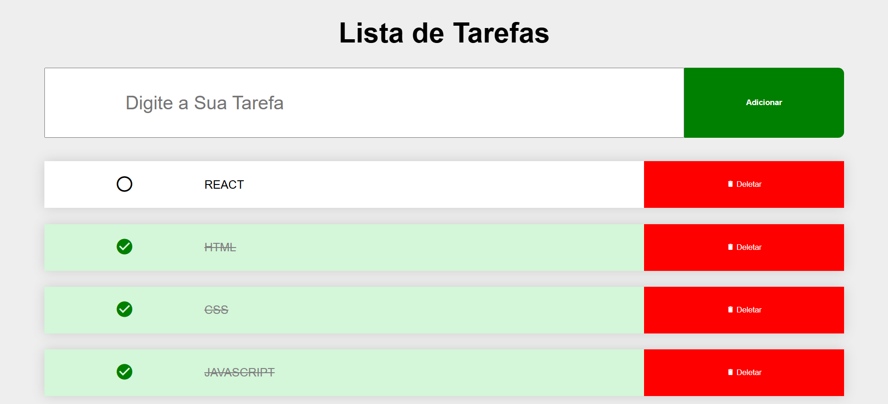

# To-Do List

Uma aplicação de lista de tarefas desenvolvida com HTML, CSS e JavaScript.

## 🚀 Funcionalidades

- Adicionar novas tarefas
- Marcar tarefas como concluídas
- Desmarcar tarefas concluídas
- Excluir tarefas
- Adicionar tarefas pressionando Enter

## 🛠️ Tecnologias

- HTML5
- CSS3
- JavaScript

## 🌐 Projeto

[Visualizar projeto](https://todo-list-zeta-mauve.vercel.app/)

## 📸 Preview

